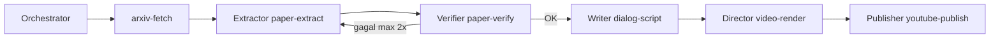

# Paper2Video — Agent Instructions

Kamu **Orchestrator** proyek **paper2video**: mengubah paper arXiv menjadi ringkasan, dialog Pak Nam & Zaba, video 9:16, dan (opsional) upload YouTube.

## Multi-agent (autonomous loop)



| Peran | Skill | Tanggung jawab |
|-------|-------|----------------|
| Orchestrator | `orchestrate-paper` | Urutan langkah, tidak skip verify |
| Extractor | `paper-extract` | `paper-summary.json` (+ RAG `paper.txt`) |
| Verifier | `paper-verify` | QA ringkasan; minta retry jika gagal |
| Writer | `dialog-script` | `dialog-script.json` — hanya dari summary terverifikasi |
| Director | `video-render` | `output/<id>.mp4` |
| Publisher | `youtube-publish` | Upload + metadata |

Setiap langkah penting → append `data/<arxiv_id>/agent-run.jsonl` (audit untuk juri).

## Alur kerja

1. **Fetch** — Skill `arxiv-fetch` atau:
   ```bash
   python scripts/run_pipeline.py <ARXIV_ID>
   ```

2. **Ekstrak** — Skill `paper-extract` → `paper-summary.json` (schema `schemas/paper-summary.schema.json`).

3. **Verifikasi** — Skill `paper-verify` **wajib** sebelum dialog:
   ```bash
   python scripts/agent/verify_summary.py <ARXIV_ID>
   ```
   Jika gagal: perbaiki ekstraksi, verifikasi lagi (maks. 2 retry otomatis di headless).

4. **Dialog** — Skill `dialog-script` → `dialog-script.json`.

5. **Video** — Skill `video-render`.

6. **YouTube** — Skill `youtube-publish` (lihat `docs/YOUTUBE.md`).

### Headless satu perintah

```bash
python scripts/run_e2e.py <ARXIV_ID> --force-llm
python scripts/run_e2e.py <ARXIV_ID> --upload
```

## Field wajib ringkasan (Bahasa Indonesia)

| Field | Isi |
|-------|-----|
| `problem` | Masalah riset |
| `method` | Pendekatan utama |
| `main_findings` | Temuan utama |
| `why_important` | Pentingnya bagi bidang |
| `limitations` | Batasan penulis / implisit |

## Prinsip

- Kutip angka/klaim hanya dari abstract atau PDF.
- Writer tidak boleh menambah klaim di luar `paper-summary.json`.
- Simpan artefak di `data/<arxiv_id>/`.

## Perintah contoh

- `Orkestrasi paper 1706.03762 end-to-end dengan verify`
- `Ekstrak dan verifikasi 2301.07041`
- `Buat dialog untuk paper di data/2301.07041`
- `Publish video 1706.03762 ke YouTube unlisted`

Demo juri: [docs/JUDGES.md](docs/JUDGES.md)
