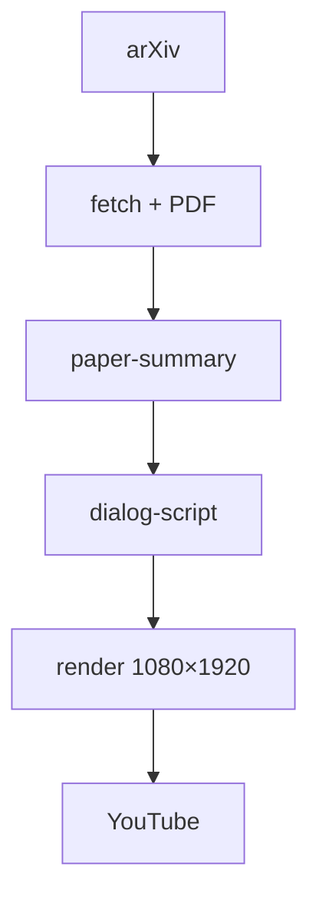

# paper2video

Pipeline otomatis **arXiv → ringkasan paper → dialog Pak Nam & Zaba → video 9:16 → YouTube**, diorkestrasi [OpenClaw](https://github.com/openclaw/openclaw) (manual) atau cron di VPS (otomatis).

## Alur



| Tahap | Perintah / skill | Output |
|-------|------------------|--------|
| Fetch | `arxiv-fetch`, `run_pipeline.py` | `data/<id>/metadata.json`, `paper.pdf`, `paper.txt` |
| Ringkasan | `paper-extract` (agent / LLM) | `paper-summary.json` |
| Dialog | `dialog-script` | `dialog-script.json` |
| Video | `video-render` | `output/<id>.mp4` |
| Upload | `youtube-publish` | `data/<id>/youtube-publish.json` |

## Video (Pak Nam & Zaba)

Format vertikal **1080×1920** (Shorts/Reels):

```
┌─────────────────────────┐
│  SUBTITLE (atas)        │
│                         │
│      [pembicara aktif]  │  sprite `personA/*_up.png`
│                         │
│  ░░ background ░░░░░░░    │  bg per speaker (paknam / zaba)
└─────────────────────────┘
```

- **Zaba** — pemula, banyak bertanya  
- **Pak Nam** — mentor, penjelasan sederhana + analogi  
- TTS: **ElevenLabs** (disarankan) atau edge-tts  
- Animasi karakter: wiggle via ffmpeg (`config/characters.paknam-zaba.json`)

## Setup lokal

### Prasyarat

- Python 3.10+
- [ffmpeg](https://ffmpeg.org/)
- Node.js 22+ — hanya jika pakai OpenClaw interaktif

```bash
chmod +x setup.sh
./setup.sh          # venv + pip install (butuh python3-venv di Ubuntu)
source .venv/bin/activate
cp .env.example .env
```

Isi `.env`:

| Variabel | Untuk |
|----------|--------|
| `ELEVENLABS_API_KEY` | TTS suara Pak Nam & Zaba |
| `ANTHROPIC_API_KEY` | Ringkasan + dialog otomatis (VPS / headless) |
| `TTS_PROVIDER` | `elevenlabs` atau `edge` |

Detail TTS: [docs/ELEVENLABS.md](docs/ELEVENLABS.md)

### Satu paper (manual)

```bash
# 1. Unduh paper
python scripts/run_pipeline.py 1706.03762

# 2. Ringkasan + dialog (OpenClaw)
openclaw config set agents.defaults.workspace "$(pwd)"
openclaw agent --message "Ekstrak paper 1706.03762 ke paper-summary.json"
openclaw agent --message "Buat dialog Pak Nam dan Zaba untuk paper 1706.03762"

# 3. Render video
python scripts/video/render.py data/1706.03762

# 4. Upload YouTube (OAuth sekali — docs/YOUTUBE.md)
python scripts/youtube/auth.py
python scripts/youtube/upload.py data/1706.03762 --privacy public
```

Contoh dialog siap pakai: `examples/dialog-script.1706.03762.json` → salin ke `data/1706.03762/`.

### OpenClaw skills

| Skill | Fungsi |
|-------|--------|
| `arxiv-fetch` | Unduh dari arXiv |
| `paper-extract` | Problem, metode, temuan, pentingnya, batasan |
| `dialog-script` | Naskah Pak Nam ↔ Zaba |
| `video-render` | Video berlapis + TTS |
| `youtube-publish` | Upload ke YouTube |

Workspace: `AGENTS.md`, `SOUL.md`, `TOOLS.md`.

## Otomasi harian (VPS)

Jadwal default (**WIB**, `config/schedule.json`):

| Waktu | Job |
|-------|-----|
| 07:00 | Ambil **3** paper arXiv terbaru (cs.CL, cs.LG, cs.AI, stat.ML) → proses penuh |
| 09:00, 14:00, 20:00 | Upload **1** video per slot dari antrian |

```bash
./scripts/daily/run_cron.sh morning   # uji proses 3 paper
./scripts/daily/run_cron.sh upload    # uji upload 1 video
```

Deploy & cron: [docs/VPS.md](docs/VPS.md) · Install: `deploy/vps/install.sh`

## Struktur repo

```
config/
  characters.paknam-zaba.json   # layout, TTS, wiggle, sprite
  schedule.json                 # jadwal VPS
personA/                        # background + sprite *_up.png
scripts/
  fetch_arxiv.py
  video/render.py
  youtube/upload.py
  daily/                        # morning_job, upload_job
skills/                         # prompt OpenClaw
data/<arxiv_id>/                # artefak per paper (gitignored)
output/<arxiv_id>.mp4
```

## Dokumentasi

| Dokumen | Isi |
|---------|-----|
| [docs/ROADMAP.md](docs/ROADMAP.md) | Status fitur & perintah ringkas |
| [docs/YOUTUBE.md](docs/YOUTUBE.md) | OAuth & upload API |
| [docs/VPS.md](docs/VPS.md) | Cron, SSH, deploy server |
| [docs/ELEVENLABS.md](docs/ELEVENLABS.md) | Voice ID & kuota TTS |

## Keamanan (Git)

Jangan commit:

- `.env`
- `config/youtube/client_secret.json`, `token.json`
- `data/*/` (kecuali contoh), `output/*.mp4`

Sudah tercantum di `.gitignore`.

## Persyaratan ringkas

- **ffmpeg** — encode video & wiggle  
- **ElevenLabs** — TTS natural (opsional: edge-tts gratis)  
- **Anthropic** — LLM untuk job harian di VPS  
- **YouTube Data API v3** — upload (OAuth desktop)  

## Lisensi

MIT — lihat [LICENSE](LICENSE).
