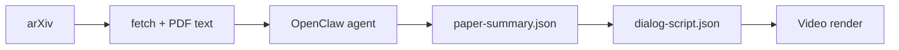

# paper2video

Pipeline **arXiv → ringkasan terstruktur → naskah dialog** untuk video penjelasan paper, diorkestrasi oleh [OpenClaw](https://github.com/openclaw/openclaw).

## Arsitektur



| Tahap | Status | Output |
|-------|--------|--------|
| Fetch arXiv | ✅ CLI | `data/<id>/metadata.json`, `paper.pdf`, `paper.txt` |
| Ekstraksi (problem, metode, …) | ✅ Skill agent | `paper-summary.json` |
| Naskah dialog 2 orang | ✅ Skill agent | `dialog-script.json` |
| Render video | ✅ CLI | `output/<id>.mp4` |
| Upload YouTube | ✅ CLI + skill | `youtube-publish.json`, URL video |

### Layout video (seperti referensi Shorts)

```
┌─────────────────────────┐
│  SUBTITLE (layer atas)  │  teks putih + outline hitam
│                         │
│   [Host]      [Ahli]    │  layer tengah — bergantian menonjol
│                         │
│  ░░░ BACKGROUND ░░░░░   │  layer belakang
└─────────────────────────┘
```

TTS per giliran (edge-tts, Bahasa Indonesia). Ganti karakter/latar di `assets/`.

## Setup cepat

```bash
chmod +x setup.sh
./setup.sh

# Jika belum ada OpenClaw:
curl -fsSL https://openclaw.ai/install.sh | bash
# atau: npm install -g openclaw@latest

openclaw onboard
openclaw config set agents.defaults.workspace "$(pwd)"
openclaw gateway
```

Di terminal lain:

```bash
source .venv/bin/activate
python scripts/run_pipeline.py 2301.07041
openclaw agent --message "Ekstrak paper 2301.07041 ke paper-summary.json"
openclaw agent --message "Buat dialog dua orang untuk paper 2301.07041"

# Video Pak Nam & Zaba (butuh ffmpeg + edge-tts)
cp examples/dialog-script.1706.03762.json data/1706.03762/dialog-script.json
python scripts/video/render.py data/1706.03762
# → output/1706.03762.mp4 (1080×1920)

# YouTube (setup OAuth sekali: docs/YOUTUBE.md)
python scripts/youtube/auth.py
python scripts/youtube/upload.py data/1706.03762
```

## Push ke GitHub

```bash
git init
git add .
git commit -m "Initial commit: paper2video pipeline"
gh repo create paper2video --public --source=. --push
# atau manual:
# git remote add origin https://github.com/<user>/paper2video.git
# git push -u origin main
```

## Skills (OpenClaw)

| Skill | Fungsi |
|-------|--------|
| `arxiv-fetch` | Unduh paper dari arXiv |
| `paper-extract` | Ekstrak problem, metode, temuan, pentingnya, batasan |
| `dialog-script` | Naskah dialog Host + Ahli |
| `video-render` | Video berlapis + TTS |
| `youtube-publish` | Upload ke YouTube (OAuth) |

File prompt workspace: `AGENTS.md`, `SOUL.md`, `TOOLS.md`.

## Persyaratan

- Node.js 22.16+ (24 direkomendasikan) — untuk OpenClaw
- Python 3.10+ — fetch/PDF/video
- ffmpeg — render video
- API key model (Anthropic, OpenAI, dll.) via `openclaw onboard`

## Lisensi

MIT — lihat [LICENSE](LICENSE).
