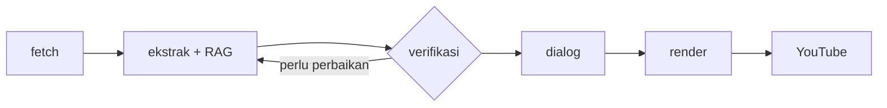

# paper2video

Pipeline yang mengubah **paper arXiv** menjadi **video edukasi vertikal berbahasa Indonesia** — dari unduh PDF, ringkasan terstruktur, dialog dua karakter, render 9:16, sampai upload YouTube. Bisa dijalankan sekali lewat CLI, diorkestrasi [OpenClaw](https://github.com/openclaw/openclaw), atau dijadwalkan di VPS.

Contoh hasil: `output/1706.03762.mp4` (paper *Attention Is All You Need*).

---

## Apa masalahnya?

Paper di arXiv biasanya panjang, teknis, dan berbahasa Inggris. Banyak orang yang butuh intinya — mahasiswa, kreator edukasi, tim lab — tidak punya waktu membuat ringkasan plus skrip video sendiri. Di sisi lain, konten vertikal (Shorts/Reels) jarang langsung bersumber dari paper asli.

**paper2video** menutup celah itu dengan alur otomatis:

```
arXiv → PDF & teks → ringkasan → dialog → video 1080×1920 → YouTube
```

Input bisa ID paper (`1706.03762`), feed RSS kategori tertentu, atau perintah dari Telegram. Output: file MP4 siap unggah plus metadata di folder paper.

---

## Format video: Pak Nam & Zaba

Bukan monolog AI yang membacakan abstract. Dua persona berdialog:

- **Zaba** — pemula, sering bertanya dan bingung  
- **Pak Nam** — mentor, menjelaskan dengan analogi sederhana  

Layout vertikal **1080×1920**: subtitle di atas, karakter aktif di tengah (`personA/*_up.png`), latar belakang berganti per pembicara. Ekspresi sprite (`neutral`, `laugh`, `thinking`, `confused`) dan animasi **wiggle** lewat ffmpeg. Suara per karakter via ElevenLabs (atau edge-tts gratis).

```
┌─────────────────────────┐
│  SUBTITLE               │
│      [pembicara aktif]  │
│  ░░ background ░░░░░░░   │
└─────────────────────────┘
```

Naskah dialog hanya boleh mengembangkan isi `paper-summary.json` — tidak menambah klaim di luar sumber paper. Contoh referensi: `examples/dialog-script.1706.03762.json`.

---

## Agen & perilaku otonom

Pipeline dibagi peran yang jelas. Masing-masing punya skill OpenClaw di folder `skills/` dan instruksi di `AGENTS.md`.



| Peran | Output utama |
|-------|----------------|
| Fetch | `metadata.json`, `paper.pdf`, `paper.txt` |
| Ekstrak | `paper-summary.json` |
| Verifikasi | QA ringkasan; minta ulang jika tidak lolos |
| Dialog | `dialog-script.json` |
| Render | `output/<arxiv_id>.mp4` |
| Publish | `youtube-publish.json` |

**Ekstraksi** memakai cuplikan `paper.txt` yang dipilih relevan (`scripts/agent/rag_context.py`), bukan sekadar memotong dari awal file.

**Verifikasi** mengecek kelengkapan field, keselarasan dengan abstract, dan konsistensi `sources` (`scripts/agent/verify_summary.py`). Jika gagal, ekstraksi dijalankan ulang dengan daftar perbaikan — maksimal dua kali — sebelum dialog dibuat.

**Log** setiap langkah agent disimpan di `data/<arxiv_id>/agent-run.jsonl`, misalnya:

```json
{"agent":"extractor","action":"start_extract","status":"running"}
{"agent":"verifier","action":"verify_summary","status":"ok"}
{"agent":"writer","action":"finish_dialog","status":"ok","detail":{"turns":12}}
```

Dengan OpenClaw, satu perintah bisa mengorkestrasi seluruh alur; agent memilih skill yang sesuai (`orchestrate-paper`, `paper-extract`, `paper-verify`, dll.):

```bash
export PAPER2VIDEO_USE_OPENCLAW=1
openclaw agent --message "Orkestrasi paper 1706.03762: fetch, extract, verify, dialog, render"
```

Penanganan situasi yang sering muncul: rate limit arXiv (RSS + jeda antar-request), PDF tidak terbaca (fallback ke abstract), paper duplikat di VPS (state), OAuth YouTube kedaluwarsa ([docs/YOUTUBE.md](docs/YOUTUBE.md)).

---

## Implementasi teknis

| Lapisan | Detail |
|---------|--------|
| Fetch | `scripts/run_pipeline.py`, RSS di `scripts/arxiv_rss.py` |
| LLM | `scripts/daily/llm.py` — Anthropic, OpenAI, DeepSeek, atau OpenCode |
| Output terstruktur | Schema di `schemas/`, JSON ringkasan & dialog |
| Video | `scripts/video/render.py`, wiggle via `ffmpeg_wiggle.py` |
| TTS | ElevenLabs / edge-tts, cache audio per giliran |

Struktur repo:

```
config/           # karakter, jadwal, YouTube
scripts/agent/    # RAG, verifikasi, log
scripts/daily/    # job cron VPS
scripts/video/
skills/           # skill OpenClaw
data/<arxiv_id>/  # artefak per paper
output/           # MP4
```

Perintah yang sering dipakai:

```bash
python scripts/run_pipeline.py 1706.03762
python scripts/run_e2e.py 1706.03762              # fetch → LLM → render
python scripts/run_e2e.py 1706.03762 --upload      # + YouTube
python scripts/video/render.py data/1706.03762
python scripts/agent/verify_summary.py 1706.03762
```

Provider LLM & API key: [docs/LLM.md](docs/LLM.md). TTS: [docs/ELEVENLABS.md](docs/ELEVENLABS.md).

---

## Menjalankan di lokal

**Prasyarat:** Python 3.10+, [ffmpeg](https://ffmpeg.org/). Node.js 22+ hanya jika memakai OpenClaw interaktif.

```bash
chmod +x setup.sh && ./setup.sh
source .venv/bin/activate
cp .env.example .env
```

Isi minimal di `.env`: `LLM_PROVIDER` + API key, `ELEVENLABS_API_KEY` (atau `TTS_PROVIDER=edge`).

Langkah manual per paper:

```bash
python scripts/run_pipeline.py 1706.03762
# lalu OpenClaw atau otomatis lewat run_e2e:
python scripts/run_e2e.py 1706.03762 --force-llm
```

Upload YouTube (OAuth sekali): [docs/YOUTUBE.md](docs/YOUTUBE.md).

---

## Produksi & deploy

Instalasi server dan cron: [docs/VPS.md](docs/VPS.md) · `deploy/vps/install.sh`.

Jadwal default (WIB, `config/schedule.json`):

| Waktu | Aktivitas |
|-------|-----------|
| 07:00 | Proses 3 paper baru dari arXiv (cs.CL, cs.LG, cs.AI, stat.ML) |
| 09:00, 14:00, 20:00 | Upload 1 video dari antrian |

```bash
./scripts/daily/run_cron.sh morning
./scripts/daily/run_cron.sh upload
```

Trigger manual dari Telegram: [docs/TELEGRAM.md](docs/TELEGRAM.md) — misalnya `/e2e 1706.03762` atau `/e2e latest upload`.

---

## OpenClaw skills

| Skill | Fungsi |
|-------|--------|
| `orchestrate-paper` | Alur penuh |
| `arxiv-fetch` | Unduh paper |
| `paper-extract` | Ringkasan terstruktur |
| `paper-verify` | QA ringkasan |
| `dialog-script` | Naskah Pak Nam & Zaba |
| `video-render` | Render + TTS |
| `youtube-publish` | Upload |
| `telegram-trigger` | Perintah dari bot |

Workspace agent: `AGENTS.md`, `SOUL.md`, `TOOLS.md`.

---

## Dokumentasi

| Dokumen | Isi |
|---------|-----|
| [docs/VPS.md](docs/VPS.md) | Cron & deploy server |
| [docs/YOUTUBE.md](docs/YOUTUBE.md) | OAuth & upload |
| [docs/TELEGRAM.md](docs/TELEGRAM.md) | Bot Telegram |
| [docs/LLM.md](docs/LLM.md) | Provider LLM |
| [docs/ROADMAP.md](docs/ROADMAP.md) | Status fitur |

Jangan commit `.env`, secret YouTube, `data/*/`, atau `output/*.mp4` — sudah di `.gitignore`.

---

## Lisensi

MIT — lihat [LICENSE](LICENSE).
